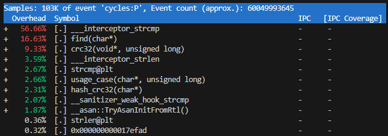

# Hash

Here we are trying to find out how different optimizations and
implementations effect on swiftness of hash table queries

## Experiment

We are loading hash table from file and making thousands/millions of queries to it

The asymptotic complexity of the algorithm O(NumOfQueries*LoadFactor) but our
project aims to find implementation with the best constant though
we are overloading the table (LF > 10) to find out which functions
are need to be accelerated

We are considering different optimizations such as:

- vectorizations with Intrinsics
- assembler implementation
- logical optimizations

## Methods

We are using 2 implementations of computing hash
which you can find in `src/hash.cpp` they are `slowhash` and
`xxh3_hash` with `nonaligned_hash`

> ##### slow
> Simple implementation with usage of byte-by-byte hashing

> ##### SSE
> Here we are using instructions set AVX-512 for hashing all word
> with one instruction moreover we have words in our initial file aligned as 32 bytes which is simples our further work

## Experimental setup

Testing machine:
    RAM : 16GB
    OS  : Windows 11 Home
    CPU:
    

> ### Test results
> We are using perf for profile and estimate our program
> especially
> `perf stat` for time measurement
> `perf record` and `perf report` for finding the narrowest places of program
> | Optimizations  | perf res                                |
> |--------------- |-----------------------------------------|
> |No optimizations| 14.631 +- 0.144 seconds  ( +- 0.98% )   |
> |Hash            | 0.06677 +- 0.00133 seconds  ( +- 1.99% )|
> |Strcmp          | 0.03803 +- 0.00157 seconds ( +- 4.13% ) |
> |Load            | 0.03701 +- 0.00172 seconds ( +-  4.41% )|

