# Хеш-таблица

Целью данного проекта является оптимизация работы хеш-таблицы с использованием машинно-зависимых оптимизаций.

## 1 Теория

Хеш-таблица — это структура данных, реализующая интерфейс ассоциативного массива. Она предназначена для хранения пар "ключ-значение" и выполнения операций добавления, удаления и поиска элементов по ключу. Для функционирования хеш-таблицы используются хеш-функции, которые преобразуют ключи в индексы таблицы. **Коллизия** возникает при совпадении значений хеш-функции для различных ключей.

### 1.1 Метод построения таблицы
Существует несколько реализаций хэш-таблиц. В данном проекте реализована таблица с разрешением коллизий методом цепочек.

#### Суть метода:
Элементы с одинаковым хешем попадают в одну ячейку в виде связного списка (возможны оптимизации, где вместо списка будет дерево). Каждая ячейка массива является указателем на связный список (цепочку) пар «ключ-значение», соответствующих одному и тому же хеш-значению ключа.

**Load Factor** (Коэффициент заполнения таблицы) - средняя длина одной цепочки.

#### Процесс работы:

- Возникновение коллизии. Новый элемент просто добавляется в соответствующий связный список.
- Поиск элемента. Сначала вычисляется его хеш-код, затем происходит переход к соответствующему связному списку, и, наконец, осуществляется последовательный поиск нужного элемента в этом списке.

#### Преимущества метода:
Простота реализации и высокая производительность. Он особенно эффективен для больших объёмов данных, где требуется быстрый поиск информации.

#### Основной недостаток:
Дополнительные затраты памяти на поля указателей.

> #### 1.1.1 Пример:
>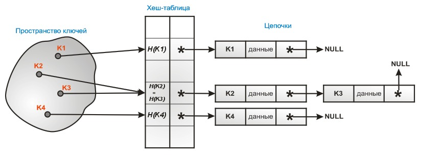
> *Рис.1 Пример работы хеш-таблицы с разрешением коллизий методом цепочек. Пространство ключей отображается в пространство хешей. В ячейке таблицы, соответствующей каждому хешу находится указатель на связный список, все ключи которого являются прообразом этого хеша.*

Подробнее про хеш-таблицу с решением коллизий методом цепочек можно прочитать в [[1]](#5-список-источников)

### 1.2 Другие методы

Кроме приведенного метода построения хеш-таблицы существуют также:

- ##### Открытое хеширование
  Коллизии разрешаются путем продолжения операции хеширования линейным или квадратичным образом, возможно также использование 2й хеш-функции
- ##### Идеальное хеширование
  Имеет структуру таблицы таблиц. Не предполагает возникновения коллизий, однако и не предусматривает добавления элементов в таблицу после построения.

Дополнительную информацию о хеш-таблицах можно найти в [[2]](#51-источники).

### 1.3 Хеш-функции

Хеш-функция — это отображение $h: U \rightarrow [0, m - 1]$, которая для произвольного ключа возвращает целое значение (хеш) в диапазоне от $0$ до $m-1$.

### Требования к хеш-функции
- **Детерминированность**
  - Одинаковые ключи всегда дают одинаковый результат.
- **Равномерное распределение**
  - Хеши распределяются равномерно по диапазону $[0, m-1]$.
- **Эффективность**

Главным критерием сравнения работы двух хеш-функций является дисперсия количества коллизий по всем хешам:

$$\mathbb{D}\xi = \mathbb{E}(\xi ^ 2) - (\mathbb{E}\xi)^2$$

,где  $\xi$ - количество коллизий.

### 1.3.1 Сравнение хеш-функций

Были рассмотрены следующие хеш-функции:
 - Длина строки
 - Сумма ASCII-значений символов
 - Полиномиальный хеш
 - crc32

<table>
  <tr>
    <td align="center">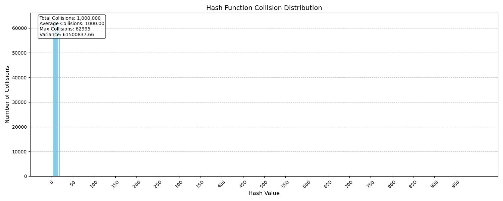<p> Рис. 2. Длина строки</p></td>
    <td align="center">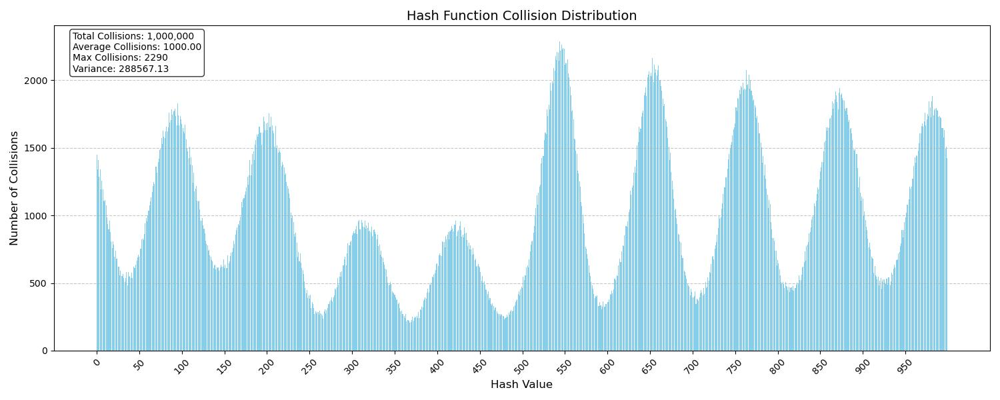<p> Рис. 3. Сумма ASCII-кодов</p></td>
  </tr>
  <tr>
    <td align="center">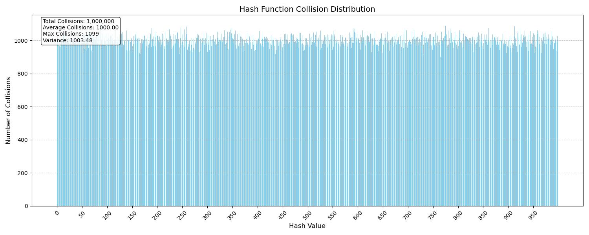<p> Рис. 4. Полиномиальный хеш</p></td>
    <td align="center">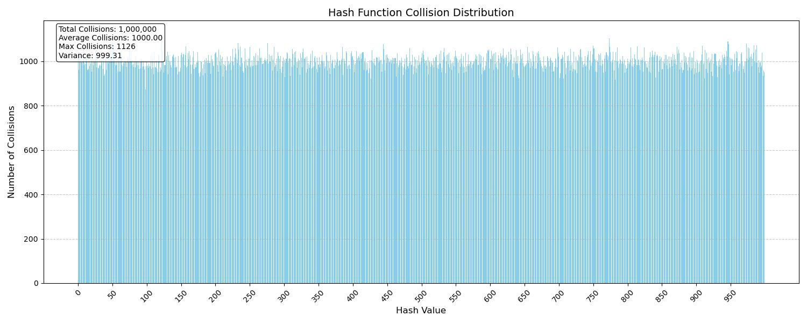<p> Рис. 5. crc32</p></td>
  </tr>
</table>

Приведем отдельно значения дисперсий:

| Хеш		     | Дисперсия		    |
|----------------|----------------------|
| Длина		     |  61500837            |
| Сумма ASCII    |  288567              |
| Полиномиальный |  1003    	        |
| crc32		     |  999			        |

### 1.3.2 Используемая хеш-функция

Из сравнения видно, что полиномиальный хеш и crc32 показали наилучшие результаты. В этом проекте в качестве основной хеш-функции был выбран crc32, так как его аппаратно поддерживает архитектура x86-64, используемая на  тестовой машине.

## 2 Описание эксперимента

В данном эксперименте будем использовать таблицу с завышенным Load Factor, так как это позволит сфокусировать внимание на аппаратных оптимизациях. Будем придерживаться значения Load Factor $\approx 15$.

1. Возьмем большой текст, состоящий из большого количества уникальных слов.
2. Загрузим данные в хеш-таблицу.
3. Выполним большое кол-во запросов слов для того, чтобы время загрузки таблицы не кардинально влияло на результаты эксперимента. (Количество запросов было подобрано эмпирическим путем так, чтобы сделать время общего измерения разумным, но занимающим бОльшую часть времени)
4. С помощью профилирования выявим узкое место программы (bottleneck), проведем оптимизацию, вычисляя относительное ускорение
5. Повторим с 3

### 2.1 Ресурсы

Для заполнения таблицы используются данные из произведения Дж.Р.Р. Толкина "Властелин колец", взятые из открытых источников. [[3]](#51-источники)

#### 2.1.1 Статистика данных

Общее количество слов - 535038
Количество уникальных слов - 15894

### 2.2 Подготовка

Для ускорения взаимодействия с памятью данные предварительно обрабатываются с помощью программы-препроцессора. Программа подсчитывает количество вхождений каждого слова в тексте и записывает результаты в файл `table/output.txt`  с выравниванием на 32 бита.

Препроцессор реализован в каталоге `process/`.

### 2.4 Способ тестирования (Usage Case)

В процессе загрузки был получен массив слов, из которых строится таблица. В качестве запросов к таблице будем по кругу выполнять запросы слов этого массива.
После загрузки данных в хеш-таблицу проводится  $10^8$ запросов поиска слов. Как упоминалось ранее, эта цифра была получено эмпирическим методом. Как будет видно далее на этапе профилирования, загрузка таблицы по времени будет незначительна, и при этом порядок величины измерения окажется равныи единицам секунд, что позволит минимизировать погрешность измерения времени.

### 2.5 Способ измерения

Измерения в данном эксперименте проводились с помощью утилит `perf` и `hyperfine`.

Утилита `perf` была выбрана по нескольким причинам:
- широкие возможности применения (профилирование,измерение времени, сбор системной статистики (branch misses, cache misses))
- возможность отображения asm кода функции при профилировании

В то же время, `hyperfine` была выбрана из-за возможности `--warmup`, которая позволит сделать измерение более точным, так как мы не будем иметь дело с так называемыми 'cold caches'. Неформально говоря, для чистоты эксперимента прежде чем приступить к замеру нужно разогнать процессор до рабочей частоты.

#### 2.5.1 Профилирование

Профилирование — сбор характеристик работы программы, таких как время выполнения отдельных фрагментов (обычно подпрограмм), число верно предсказанных условных переходов, число кэш-промахов и т. д. Инструмент, используемый для анализа работы, называют профилировщиком или профайлером (англ. profiler). [[4]](#51-источники)

В нашем случае профилирование заключалось в записи работы программы с помощью `perf record -g {ИмяИспФайла}`. Далее выводился результат с использованием `perf report --sort=sr --no-children`, где флаги отвечают за сортировку результатов по `self`, то есть собственному относительному времени работы.

#### 2.7.2 Измерение времени

Измерение времени проводилось со следующими параметрами:
- `--warmup` 3
- `-r` 5

Более того, `hyperfine` также предоставляет доступ к таким важным для эксперимента значениям, как дисперсия, минимальные и максимальные измерения, что позволит исключить из измерений "ошибочные" точки.

### 2.5 Запуск

Все команды следует выполнять из корневой папки проекта.

> #### 2.5.1 Запуск препроцессора:
>  `make proc`
> #### 2.5.2 Компиляция и запуск тестовой программы:
>  `make` и `make run` соответственно
> #### 2.5.3 : Запуск препроцессора
> `make proc`
> #### 2.5.4 Запуск профилирования:
> `make perf`
> #### 2.5.5 Запуск отображения статистики запуска:
> `make perfstat`
> ### 2.5.6 Запуск измерения времени
> `make time`

### 2.6 Описание установки

#### 2.6.1 Аппаратная часть

<br>
<details>
<summary> Посмотреть </summary>

RAM : 16GB
CPU : 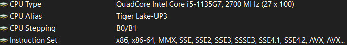
Caches: L1 - 8kb
        L2 - 5Mb
        L3 - 8Mb
Mode: Performance (charge enabled)
</details>
</br>

#### 2.6.1 Программная часть

<br>
<details>
<summary> Посмотреть </summary>

OS  : Windows 11 Home х86_64 with usage of archlinux WSL for profiling
WSL : Linux DEATHS 5.15.167.4-microsoft-standard-WSL2 #1 SMP Tue Nov 5 00:21:55 UTC 2024 x86_64 GNU/Linux
Compiler: gcc (GCC) 15.1.1 20250425 with optimization -O3
Perf: perf version 6.14-1
Hyperfine: hyperfine 1.19.0

</details>
</br>

### 2.7 Структура проекта

- `Build` - папка с бинарными файлами
- `images` - иллюстрации к `READMEru.md`
- `Include` - headers
- `process` - препроцессор
- `src` - исходники
- `table` - результат препроцессора
- `txtsrc` - книга

## 3 Процесс оптимизаций

Изначально проект находится в состоянии "без оптимизации". Для применения/отката той или иной оптимизации следует закомментировать/раскомментировать соответствующую строчку в `Makefile`

```
# CC_FLAGS += -D NOSTRCMP
# CC_FLAGS += -D NOALIGN
# CC_FLAGS += -D NOHASH
```

**NB**: после изменения состояния `NOHASH` может потребоваться повторный запуск препроцессора

#### 3.1 Первое профилирование. Strcmp

При первом запуске профилирования ([см 2.5.4](#254-запуск-профилирования)) и измерения времени был получен следующий отчет:

*Рис.6 Снимок экрана. Первое профилирование. Левый столбец - self. Правее название функции.*

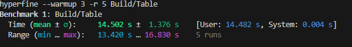
*Рис. 7 Снимок экрана. Первый замер времени. Все точки в пределах $3\sigma$, то есть приняты валидными.*

Как можно видеть из отчета профилирования узким местом программы является функция `strcmp`. сто неудивительно, так как в процессе поиска слова в таблице strcmp выполняется каждый раз при переходе к новому узлу списка.

Заметим, что в данном случае имеются данные, выровненные на 32 байта, дополненные нулями, что позволит сравнить строчки целиком за одно сравнение, что в силу своего отличия от общего случая, где длина строки переменна, позволит нам "выиграть по времени".

<br>
<details>
<summary> Посмотреть реализацию</summary>

```asm
mystrcmp:
    push rbp

    vmovdqu ymm0, [rsi]
    vmovdqu ymm1, [rdi]

    vpcmpeqb ymm2, ymm0, ymm1
    vpmovmskb eax, ymm2

    cmp eax, 0xffffffff
    jne .not_equal

.equal:
   xor rax, rax

.not_equal:
.done:
    pop rbp
    ret
```

</details>
</br>

После применения этих оптимизаций были получены следующие результаты:
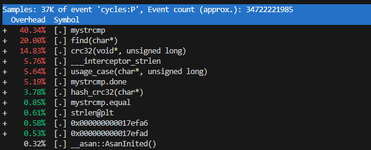
*Рис. 8 Снимок экрана. Профилирование после оптимизации strcmp. Self вклад уменьшился, но при этом все равно максимальный.*

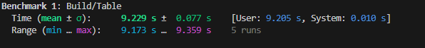
*Рис. 9 Снимок экрана. Замер времени после первой оптимизации. Все точки в пределах $3\sigma$.*

Ускорение относительно предыдущего варианта: $\approx 50\%$


### 3.2 Локализация и Выравнивание

Нетрудно видеть, что strcmp все еще является узким местом программы, несмотря на то, что мы значительно увеличили скорость программы. Была собрана статистика запуска с помощью  `perf stat`:

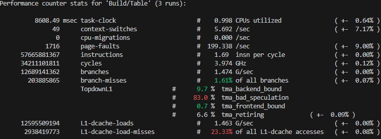
*Рис. 10 Снимок экрана. Статистика запуска программы после первой оптимизации. Нас интересует нижняя строчка. Слишком большое значение cache-miss.*


Из приведенной статистики был сделан вывод, что программа не использует все преимущества локализации, и было принято решение исправить функцию загрузки таблицы так, чтобы память для всех узлов связного списка была выделена единовременно, одним куском, что позволило одной цепочке узлов быть друг за другом в памяти, что ускорит программу, за счет меньшего количества cache missов. Также исправление позволило тратить меньше ресурсов на переход от одного узла к другому (указатель +1 вместо ->next).

<br>
<details>
<summary> Посмотреть реализацию</summary>

```С
void load_table(const char* filename, char** storage, size_t* len){

    Nodes = (HashNode*) calloc ((*len >> 5) + 1, sizeof(HashNode));

    ...

    HashNode *new_node = Nodes + (ptr >> 5);
   ...
        if (index != last)
            Table[last] = new_node - 1;
        else
            new_node->next = new_node - 1;

        last = index;
    }

    Table[last] = Nodes + ((ptr >> 5) - 1);
    Nodes->next = NULL;

}
```

</details>
</br>

После этого небольшого исправления strcmp перестала быть узким местом.
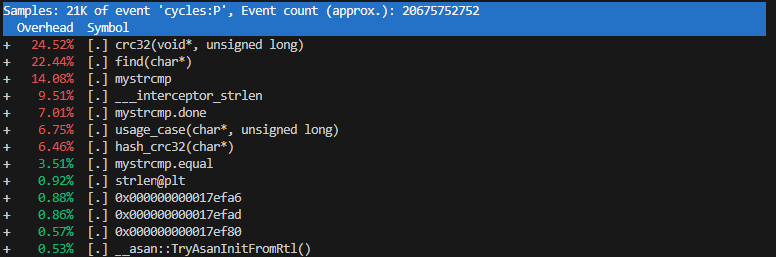
*Рис. 11 Снимок экрана. Профилирование после применения локализации. Теперь strcmp не является самым узким местом.*


*Рис. 12 Снимок экрана. Замер времени после оптимизации выравнивания. Все значения в пределах $3\sigma$.*

Ускорение относительно предыдущего варианта: $\approx 80\%$

#### Оптимизация хеш-функции

Следующей целью оптимизаций была выбрана хеш-функция, как самое узкое место. Как было отмечено выше, функция crc32 имеет аппаратную поддержку архитектурой x86-64, поэтому была реализована новая функция с использованием inline-ассемблера:

<br>
<details>
<summary> Посмотреть реализацию</summary>

```С
uint32_t asm_hash_crc32(const void *data){
    uint32_t result;
    const uint8_t *bytes = (const uint8_t *)data;

    __asm__ volatile (
        "mov    $0xFFFFFFFF, %%eax\n\t"
        "crc32q  (%%rsi), %%rax\n\t"
        "crc32q  8(%%rsi), %%rax\n\t"
        "crc32q  16(%%rsi), %%rax\n\t"
        "crc32q  24(%%rsi), %%rax\n\t"
        "not    %%eax\n\t"
        : "=a" (result)
        : "S" (bytes)
        : "memory", "cc"
    );

    return result % TABLE_SIZE;
}
```

</details>
</br>

После этой оптимизации был получен следующий профайл:
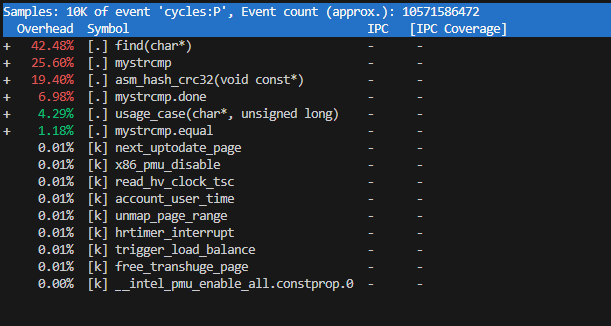
*Рис. 13 Снимок экрана. Профилирование после применения оптимизации хеш-функции.Теперь хеш-функция не является самым узким местом.*

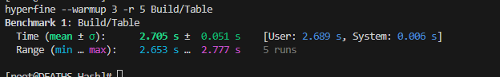
*Рис. 14 Снимок экрана. Замер времени после применения оптимизации хеш-функции. Все значения в пределах $3\sigma$.*

Ускорение относительно предыдущего варианта: $\approx 90\%$

### 4 Итоги

В результате применения к нашей программе оптимизаций был получен значительный прирост производительности (более чем в 5 раз).

> В таблице ниже продублированы результаты измерений времени.
>
> | Оптимизации    | Время   (сек)     | Ускорение (отн. пред.)| Ускорение (отн. нач.)
> |--------------- |-------------------|-----------------------|----------
> |No optimizations| 14.50 +- 1.38     |          1            |  1
> |Strcmp          | 9.23 +- 0.08      |         1.57          |  1.57
> |Localization    | 5.16 +- 0.05      |         1.79          |  2.81
> |Hash            | 2.71 +- 0.05      |         1.90          |  5.33

Конечно, в нашем случае можно использовать и другие алгоритмы хеширования, такие как Открытое хеширование или Идеальное хеширование. Но если вы не видите возможных изменений именно в алгоритме, вам стоит попробовать провести ассемблерные оптимизации, это может привести к поистине удивительным результатам.

### 5 Список источников

#### 5.1 Источники
1. Метод цепочек [(Infostart)](https://infostart.ru/1c/articles/2365110/)
2. Хеш-таблицы [(Wikipedia)](https://ru.wikipedia.org/wiki/Хеш-таблица)
3. "Властелин Колец" Дж. Р. Р. Толкиен [(RoyalLib)](https://royallib.com/book/tolkien_j/the_lord_of_the_rings.html?ysclid=mapgne2e86142303436)
4. Профилирование [(Wikipedia)](https://ru.wikipedia.org/wiki/Профилирование_(информатика))

#### 5.2 Медиа
1. Рис. 1 Пример работы хеш-таблицы [(Wiki-конспекты ИТМО)](https://neerc.ifmo.ru/wiki/images/0/0a/Hash_open.jpg)
2. Рис. 2 - 5 Лабораторная работа по алгоритмам хеш-функций [(GitHub автора)](https://github.com/SanyaKovylin/ALlabsGORITHMS/tree/LabHash/LabHash)
3. Рис. 6 - 13 Снимки экрана, полученные в ходе выполнения данного эксперимента.
